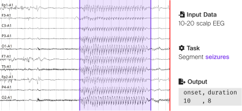
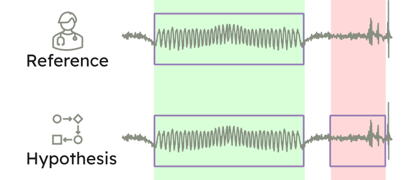

This benchmark aims to evaluate seizure detection models that detect the onset and duration of all epileptic seizures in a recording from long-term EEG from the epilepsy monitoring unit.



### Input signal

Continuous long-term EEG signals from the epilepsy monitoring unit are provided as input data. The recordings are stored in [`.edf` files](https://www.edfplus.info/). They contain the 19 electrodes of the international [10-20 system](https://en.wikipedia.org/wiki/10%E2%80%9320_system_(EEG)) in a [referential, common average montage](https://www.learningeeg.com/montages-and-technical-components#referential). The channels are provided in the following order: `Fp1-Avg, F3-Avg, C3-Avg, P3-Avg, O1-Avg, F7-Avg, T3-Avg, T5-Avg, Fz-Avg, Cz-Avg, Pz-Avg, Fp2-Avg, F4-Avg, C4-Avg, P4-Avg, O2-Avg, F8-Avg, T4-Avg, T6-Avg`. The recordings are sampled at 256 Hz. The recordings contain continuous EEG signals. They are guaranteed to last at least 1 minutes. Most recordings are approximately one hour long. File size is guaranteed to be smaller than 1 GB.


### Model output

The model should generate a tab-separated values `.tsv` file as an output. This is a text file that uses a tab as a delimiter to separate the different columns of information, with each row representing one seizure event. Each annotation file is associated with a single EEG recording.

The annotation file is [HED-SCORE](https://hed-schemas.readthedocs.io/en/latest/hed_score_schema.html) compliant. It contains the following information:

- **onset:** represents the start time of the event from the beginning of the recording, in seconds.
- **duration:** represents the duration of the event, in seconds.
- **event:** indicates the type of the event. The event field is primarily used to describe the seizure type. Seizure events begin with the value `sz`. Recordings with no seizures can use the string `bckg` with the event duration equal to the recording duration.
- ***confidence:*** represents confidence in the event label. Values are in the range \[0–1\] \[no confidence – fully confident\]. This field is intended for the confidence of the output prediction of machine learning algorithms. It is optional, if it is not provided value should be `n/a`.
- ***channels:*** represents channels to which the event label applies. If the event applies to all channels, it is marked with the value `all`. Channels are listed with comma-separated values. It is optional, if it is not provided value should be `n/a`.
- **dateTime:** start date time of the recording file. The date time is specified in the POSIX format `%Y-%m-%d %H:%M:%S` (e.g., `2023-07-24 13:58:32`). The start time of a recording file is often specified in the metadata of the `edf`.
- **recordingDuration:** refers to the total duration of the recording file in seconds.

Here is an example of a HED-SCORE compliant annotation file with three seizures:

```tsv
 onset	duration	eventType	confidence	channels	dateTime	         recordingDuration
 296.0	40.0    	sz      	n/a     	n/a     	2016-11-06 13:43:04	 3600.00
 453.0	12.0    	sz      	n/a     	n/a     	2016-11-06 13:43:04	 3600.00
 895.0	21.0    	sz      	n/a     	n/a     	2016-11-06 13:43:04	 3600.00
```

In this benchmark the `confidence` and `channels` fields are not used. They will not be evaluated.

### Training data

Benchmark participants are encouraged to train their models on any combination of the three publicly available large datasets or any private datasets they might have access to. The main public datasets are:

| Dataset | \# subjects | duration \[h\] | \# seizures |
|---|---|---|---|
| [CHB-MIT *](https://physionet.org/content/chbmit/1.0.0/) | 24 | 982 | 198 |
| [TUH EEG Sz Corpus](https://isip.piconepress.com/projects/tuh_eeg) | 675 | 1476 | 4029 |
| [Siena Scalp EEG](https://physionet.org/content/siena-scalp-eeg/1.0.0) | 14 | 128 | 47 |

*\* The Physionet CHB-MIT Scalp EEG Database contains bipolar EEG channels and not referential channels as expected in this benchmark.*

To facilitate model training across multiple datasets, we provide the following library to convert these datasets to the SzCORE standardized format for data and seizure annotations.



We provide the Physionet CHB-MIT and Siena Scalp EEG Databases in this format on Zenodo:

- [BIDS CHB-MIT Scalp EEG Database](https://zenodo.org/records/10259996)
- [BIDS Siena Scalp EEG Database](https://zenodo.org/records/10640762)

The licenses of the other datasets require you download and convert them yourself.

### Evaluation

Submissions are evaluated on event-based F1 score computed on a collection of private and public datasets recorded in epilepsy monitoring units.

Event based scoring relies on overlap. If the reference event and the hypothesis event overlap, it is a correct detection (`True Positive`). If the hypothesis event does not overlap with a reference event it is a false detection (`False Positive`).



The following event-based scoring parameters are used in this benchmark:

- **Minimum overlap:** between the reference and hypothesis for a detection. We use any overlap, however short, to enhance sensitivity.
- **Pre-ictal tolerance:** tolerance with respect to the onset of an event that would count as a detection. We use a 30 seconds pre-ictal tolerance.
- **Post-ictal tolerance:** tolerance with respect to the end time of an event that would still count as a detection. We use a 60 seconds post-ictal tolerance.
- **Minimum duration:** between events resulting in merging events that are separated by less than the given duration. We merge events separated by less than 90 seconds which corresponds to the combined pre- and post-ictal tolerance.
- **Maximum event duration:** resulting in splitting events longer than the given duration into multiple events: We split events longer than 5 minutes.

The [`timescoring`](https://github.com/esl-epfl/timescoring) library is used to compute these scores.



Results are computed on a subject by subject basis. Overall results are computed as the average across all subjects. The [`szcore-evaluation`](https://github.com/esl-epfl/szcore-evaluation) library is used to compute the overall score.



## Submission guidelines

Participants submit a pre-trained model packaged as a Docker image. The image should be publicly available on an image registry.

### Docker image

The image should contain the following two volumes:

```Dockerfile
VOLUME ["/data"]
VOLUME ["/output"]
```

The `/data` volume is read-only. It contains the EEG file that should be analyzed. The `/output` volume is read-write. The algorithm should write the output `.tsv` file in this folder.

The image should define the following two environment variables:

```Dockerfile
ENV INPUT=""
ENV OUTPUT=""
```

The `INPUT` and `OUTPUT` environment variables contain the path to the input `.edf` file and output `.tsv` file relative to the `/data` and `/output` folders.

The image should define a `CMD` that takes the `INPUT` and `OUTPUT` to produce the output `TSV` file. Here is an example of such a `CMD`:

```Dockerfile
CMD python3 -m gotman_1982 "/data/$INPUT" "/output/$OUTPUT"
```

An example of a Docker packaged algorithm can be found here:



The docker images are run on a machine that is not connected to internet.

### Submission form

Submissions are made as a [pull-request](https://github.com/esl-epfl/szcore/pulls) of a `.yaml` file to the [szCORE GitHub repository](https://github.com/esl-epfl/szcore). The `.yaml` file should contain the following information:

```yaml
title: "Name of the algorithm"
short_title: "Short name (max. 20 characters)"
image: "registry path"
version: "algorithm version"
date: "algorithm release date"
authors:
  - given_name: "Jonathan"
    family_name: "Dan"
    institution: "affiliation"
    email: "(optional) email"
  - given_names: "Jane"
    family_names: "Doe"
    institution: "Company"
    email: null
abstract: >-
  Abstract that describes your algorithm. We recommend the following structure
  for abstracts:
  - A clear description of the algorithm, and/or ML model including assumptions
  and parameters.
  - A description of the input data of the algorithm specifying sampling
  frequency, and number of channels.
  - A description of the training data.
  - An explanation of any training data that were excluded, and all
  pre-processing steps.
  - An analysis of measured performance on the publicly available datasets
  - An analysis of the complexity (time, space, sample size) of any algorithm.
              
repository: "(optional) Link to the source code of the algorithm"
license: "Docker image licence"
datasets:
  - Physionet Siena Scalp EEG
  - Dianalund Scalp EEG dataset
```

Here is a tool to generate a valid `.yaml` file that you should then submit as a [pull-request](https://github.com/esl-epfl/szcore/pulls).



### YAML form generator


