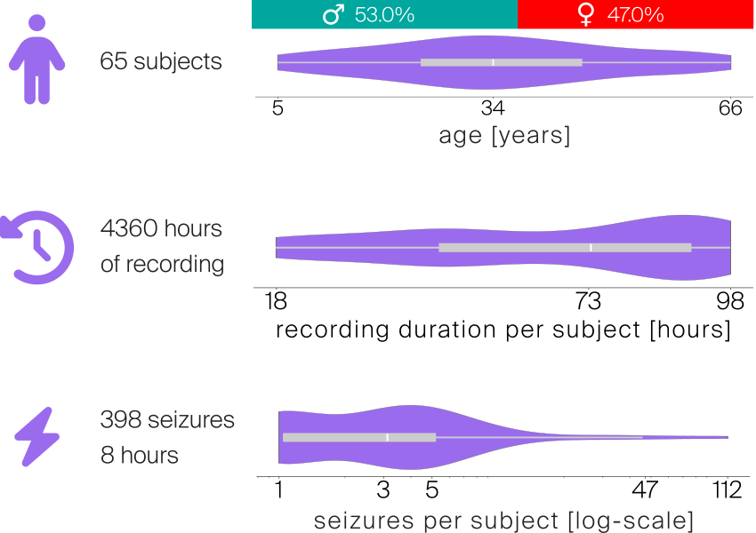


The dataset is mostly kept private for independent evaluation of algorithms.


- v1.0.0

The dataset was collected at the EMU of the Filadelfia Danish Epilepsy Centre in Dianalund. It was collected from January 2018 to December 2020. Data were recorded with the NicoletOne™ v44 amplifier. The inclusion criteria were at least one seizure during the hospital stay with a visually identifiable electrographic correlate to the seizures recorded on the video. In total, 65 subjects met the inclusion criteria. The total recording duration was 4360 hours. Subjects stayed at least one day (18 hours) and a maximum of one week (98 hours) in the EMU. The majority of patients were adults (median=34). Eight children were recruited for the study. The minimum age is 5 years old, and the maximum is 66 years old. A total of 398 seizures were recorded. They were independently annotated by three board-certified neurophysiologists with expertise in long-term video-EEG monitoring. In case of disagreement, a ground-truth label was obtained after a consensus discussion between the experts. The statistics of the dataset are illustrated in the figure below. Data were anonymized and then converted to a BIDS-compatible version using the [epilepsy2bids](https://github.com/esl-epfl/epilepsy2bids) python library. The library was adapted to support the Dianalund dataset. It is publicly available on GitHub. The conversion standardizes the EEG channels' number, naming, and order to the 19 channels of the 10-20 system. They are re-referenced to a common average montage sampled at 256~Hz.


